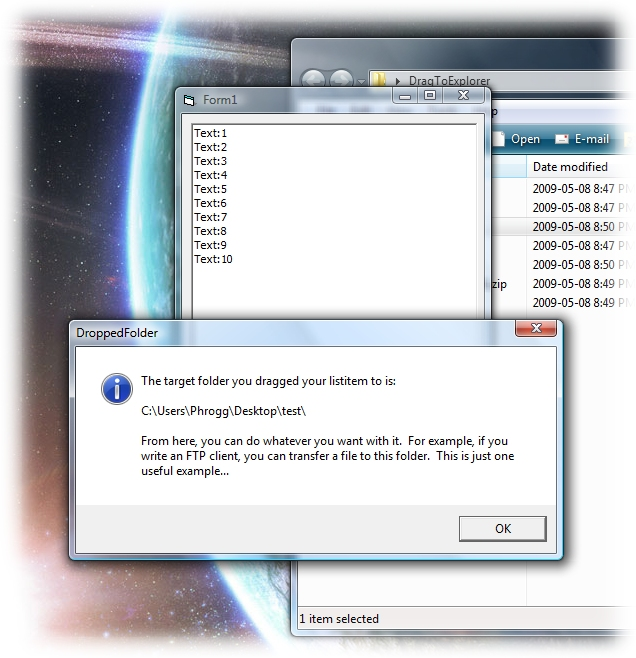



## Drag To Explorer

### Description

Drag To Explorer:

This project demonstrates something that is really hard to find out there in VB-land: a way to drag a listitem from a listview into explorer and return the dropped path, thereby allowing you to do whatever it is you want to do. When searching online, you find this question a lot, but nobody seems to answer the question that was asked, or provides some other answer that doesn't do any good.

The method I use to accomplish this is somewhat of a hack, but it works.

Check out the source and hope it works for you! It does for me...!

This has been tested using XP and Vista Home Premium.

Below is a basic concept of how I perform this magic.

* The following techniques are used to accomplish this task: ShellFileOps to use the recycle bin, ShellNotify to be alerted when files are created in the filesystem, and GetTempFileName() to create a temporary file (which is recycled, not left behind).

* Populate the listview with whatever it is you need.

* Drag a listitem to the desktop (or any other explorer window/location).

* When the drag operation starts, set the AllowedEffects to vbDropEffectCopy.

* When the drag operation enters an explorer location, create a temp file and add it to the Data.Files() object.

* When you complete your drag operation, the temp file is moved from it's current location in the temp folder to where you dropped the list item in explorer. This is handled automatically because of AllowedEffects.

* ShellNotify will grab the temp file's new location.

* Whala! You now know where you dragged your listitem to.

* Cleanup: Use ShellFileOps to send the temp file to the recycle bin with permanent delete and no dialog.

* After that, do whatever you need to do with the DroppedFolder location!

If you have any problems with this code, please let me know and I'll do what I can to help you out.
 
### More Info
 

             |
---                |---
**Submitted On**   |2009-05-08 08:00:06
**By**             |[Michael Redwine](https://github.com/Planet-Source-Code/PSCIndex/blob/master/ByAuthor/michael-redwine.md)
**Level**          |Intermediate
**User Rating**    |5.0 (20 globes from 4 users)
**Compatibility**  |VB 6\.0
**Category**       |[Miscellaneous](https://github.com/Planet-Source-Code/PSCIndex/blob/master/ByCategory/miscellaneous__1-1.md)
**World**          |[Visual Basic](https://github.com/Planet-Source-Code/PSCIndex/blob/master/ByWorld/visual-basic.md)
**Archive File**   |[Drag\_To\_Ex215183582009\.zip](https://github.com/Planet-Source-Code/michael-redwine-drag-to-explorer__1-72074/archive/master.zip)

